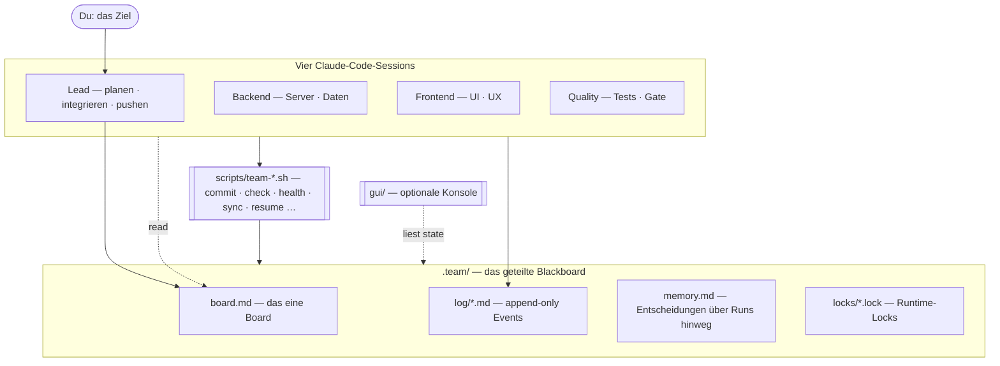

<div align="center">


### Vier Claude-Code-Sessions. Ein Repository. Koordiniert über reine Dateien.

Ein **aufgaben-agnostisches** Scaffold, das vier Claude-Code-Agenten gemeinsam an einem
Repo arbeiten lässt — ohne Datenbank, ohne Message-Broker, ohne Framework. Die gesamte
Koordination liegt in einem `.team/`-Ordner aus Markdown und einer Handvoll POSIX-Shell-Skripten.

<p>
  <a href="https://github.com/BEKO2210/4-Agent-Team-Kit-for-Claude-Code/actions/workflows/gate.yml"></a>
  <a href="LICENSE"></a>
  
  
  
</p>

<a href="#quickstart"><b>Quickstart</b></a> ·
<a href="#nutzung"><b>Nutzung</b></a> ·
<a href="#architektur"><b>Architektur</b></a> ·
<a href=".team/PROTOCOL.md"><b>Protokoll</b></a> ·
<a href="ROADMAP.md"><b>Roadmap</b></a> ·
<a href="README.md"><b>English</b></a>

</div>

---

## Inhalt

- [Warum dieses Projekt](#warum-dieses-projekt)
- [Features](#features)
- [Vorschau](#vorschau)
- [Quickstart](#quickstart)
- [Nutzung](#nutzung)
- [Architektur](#architektur)
- [Projektstruktur](#projektstruktur)
- [Qualität & Sicherheit](#qualität--sicherheit)
- [Roadmap](#roadmap)
- [Beitragen](#beitragen)
- [Lizenz](#lizenz)

---

## Warum dieses Projekt

Mehrere KI-Coding-Agenten in einem Repository enden meist im Chaos: sie überschreiben sich
gegenseitig, kollidieren bei Commits und verlieren den Überblick. Die gängige Antwort ist
ein schweres Orchestrierungs-Framework mit eigener Laufzeit und Lernkurve.

Dieses Kit geht den umgekehrten Weg. Koordination wird auf ihre Primitive reduziert — ein
**Board**, **Logs pro Agent**, **Datei-Locks** und ein **Green Gate** — und jedes davon ist
ausschließlich mit Dateisystem und Git umgesetzt. Das Ergebnis ist ein
Koordinations*protokoll*, kein Framework: in jedes Repo kopieren, vier Terminals öffnen,
und die Agenten bleiben in ihrer Spur, serialisieren ihre Commits, committen nie rot.

**Für wen es gedacht ist**

- Entwickler, die ein kleines Team aus Claude-Code-Agenten an echtem Code arbeiten lassen wollen.
- Alle, die Multi-Agent-Koordination ohne Framework-Lock-in verstehen wollen.
- Teams, die mit **null externer Infrastruktur** auskommen müssen.

> [!NOTE]
> Das ist ein Koordinations-Scaffold, kein Autopilot. Du gibst das Ziel vor; die Agenten
> arbeiten nach den Regeln aus [`.team/PROTOCOL.md`](.team/PROTOCOL.md).

## Features

| | Feature | Was es tut |
|---|---|---|
| 🗂️ | **Dateibasierte Koordination** | Alles liegt in `.team/` (Board, Logs, Rollen, Locks) — lesbar, auditierbar, in Git versioniert. Keine Services nötig. |
| 🔒 | **Atomare Commit-Serialisierung** | `team-commit.sh` nimmt einen atomaren `mkdir`-Lock, fährt das Gate, staged nur deine Pfade, committet als `[role] …`. Niemals `git add -A`. |
| ✅ | **Green Gate** | `team-check.sh` muss vor jedem Commit grün sein — „nie rot committen". Eine Datei für deinen Stack anpassen, fertig. |
| 🫀 | **Health-, Stale-Task- & Deadlock-Erkennung** | `team-health.sh` meldet pro Agent active/idle/stale, markiert hängende `doing`-Tasks und signalisiert, wenn alles `blocked` ist. |
| 🔁 | **Board ↔ Log-Abgleich** | `team-sync.sh` betrachtet die append-only Logs als Autorität und meldet, wo das Board abdriftet. |
| ♻️ | **Crash-Recovery & Memory** | `team-resume.sh` rekonstruiert den Stand aus Logs + Git; `.team/memory.md` trägt Entscheidungen über Runs hinweg. |
| 🛟 | **Resilienz** | Fallback-Lead (`team-lead-claim.sh`) und `.team/`-Snapshots (`team-backup.sh`) — ein hängender Lead oder ein schlechter Push ist nicht fatal. |
| 🌿 | **Stärkere Isolation (optional)** | `team-worktrees.sh` gibt jedem Agenten einen eigenen Git-Worktree + Branch; der Lead integriert per Merge. |
| 🖥️ | **Optionale Live-Konsole** | Eine kleine lokale Web-UI (`gui/`) führt alle vier Sessions in einem Fenster. Pro-Rolle-Progressbars, rollen-farbige Karten mit Corner-Brackets und Channel-Callsigns, ein mittiges Equalizer-Aktivitätsmeter, ein klarer „selected"-Ring auf der fokussierten Karte und ein pulsierender „⚠ needs input"-Badge wenn ein Agent auf eine Bestätigung wartet. |
| 🔌 | **Optionaler MCP-Server** | `mcp/` exponiert den Team-Zustand (Board, Logs, Memory, Health, Metriken) als read-only MCP-Ressourcen für jeden MCP-Client. |
| 🧬 | **Typisierter State** | `schema/team-state.schema.json` ist der maschinen-validierbare Vertrag, den `/state`, der MCP-Server und `team-snapshot.sh` einhalten. |
| 🧪 | **In CI getestet** | Eine eigenständige Bash-Test-Suite (`tests/run.sh`, aktuell 88 Checks) läuft bei jedem Push via [`.github/workflows/gate.yml`](.github/workflows/gate.yml). |

## Vorschau

Die optionale GUI — **TEAM // CONSOLE** — zeigt alle vier Agenten in einem Fenster und
eine Live-Vitals-Leiste (Progress pro Rolle + Health pro Agent), die `.team/` alle paar
Sekunden neu liest.


Eine Detail-Sicht auf eine Karte — Corner-Brackets in der Rollen-Farbe,
Channel-Callsign (`CH·01`), das mittige 4-Bar-Aktivitätsmeter das sich mit Live-Terminal-Output
animiert, und ein „selected"-Badge wenn die Karte fokussiert ist:


Lokal starten: [`node gui/server.js`](#optional-die-gui) — siehe [Nutzung](#nutzung).

## Quickstart

> [!IMPORTANT]
> Voraussetzungen: **Bash**, **Git** und die **[Claude Code](https://claude.com/claude-code)-CLI**.
> Die optionale GUI braucht zusätzlich **Node.js** (18+).

**1. Kit in dein Repo kopieren**

```bash
# aus dem Repo-Root
cp -r /pfad/zum-kit/.team .team
cp -r /pfad/zum-kit/scripts/* scripts/
chmod +x scripts/team-*.sh scripts/lib/*.sh
printf '\n.team/locks/*\n.team/log/events.log\n.team/state/\n.team/backups/\n.team/snapshots/\n.team/metrics.md\n' >> .gitignore
```

**2. Gate und Lanes auf dein Projekt zeigen**

```bash
$EDITOR scripts/team-check.sh     # echten Lint+Test-Befehl eintragen
$EDITOR .team/roles/*.md          # die Globs jeder Lane an dein Repo anpassen
```

**3. Skripte verifizieren**

```bash
bash tests/run.sh                 # die Test-Suite (aktuell 88 Checks); muss grün sein
scripts/team-health.sh            # gibt einen Health-Report aus
```

## Nutzung

**Das Team starten (vier Terminals)**

1. **4 Terminals** im Repo öffnen, in jedem `claude` laufen lassen.
2. Den passenden Block aus [`PROMPTS.md`](PROMPTS.md) einfügen — Lead, Backend, Frontend, Quality.
3. Im **Lead**-Terminal `<<< paste … >>>` durch dein Ziel ersetzen.
4. Der Lead füllt das Board und pingt die anderen; sie arbeiten ihre Lanes ab.
5. Jedes Terminal kannst du mit `state` weiterstoßen — der Agent macht autonom weiter.
6. Fertig, wenn jede Board-Zeile `done` ist, Quality das Gate abzeichnet und der Lead pusht.

> [!TIP]
> `state` heißt *mach das Nächste*, nicht *berichte*. Ein gestoßener Agent liest Board und
> Logs neu, deblockiert zuerst andere und hält das Gate grün.

**Die Regeln in einem Atemzug**

In deiner Lane bleiben · nur eigene Dateien schreiben · committen nur über `team-commit.sh`
(niemals `git add -A`) · grün vor Commit · nur der Lead pusht · schwere Operationen unter Lock ·
jeden Schritt loggen.

**Koordinations-Helfer**

```bash
scripts/team-health.sh                  # wer aktiv/idle/stale · stale Tasks · Deadlock
scripts/team-sync.sh [--strict]         # wo das Board von den Logs abdriftet
scripts/team-resume.sh                  # State aus Logs + Git nach Crash/Restart rekonstruieren
scripts/team-metrics.sh                 # Durchsatz pro Rolle + Board-Fortschritt
scripts/team-backup.sh [restore [file]] # .team/ snapshotten / wiederherstellen
scripts/team-lead-claim.sh <role>       # Fallback-Lead aufzeichnen
scripts/team-lint-log.sh                # strukturierte @role-Handoff-Zeilen prüfen
scripts/team-worktrees.sh setup         # pro Rolle ein Git-Worktree
scripts/team-role.sh add <name> <globs> # neue Rolle zur Laufzeit + Start-Prompt
scripts/team-handoff.sh                 # Briefing für eine frische Session
scripts/team-sections.sh                # Sub-Team-Sicht (board.md "## name"-Sektionen)
scripts/team-federate.sh <repo>...      # Boards über mehrere Repos aggregieren
scripts/team-snapshot.sh [--save]       # vollständigen Team-Zustand als JSON ausgeben/speichern
scripts/team-diff.sh A.json B.json      # zwei Snapshots vergleichen
scripts/team-commit.sh --dry-run <role> "msg" <paths>   # Gate + Vorschau, kein Commit
```

<a id="optional-die-gui"></a>

**Optional — die GUI**

```bash
cd gui && npm install && cd ..
node gui/server.js            # → http://localhost:4173
```

Die Konsole führt jeden Agenten als echtes Terminal, ergänzt Knöpfe für die häufigen
Befehle (Kickoff, `state`, Enter, `y`, Esc, ^C, restart) und pollt `.team/` für die
Live-Vitals-Leiste. Details in [`gui/README.md`](gui/README.md).

## Architektur



## Projektstruktur

```text
.
├─ .team/                 # das Blackboard (Protokoll, Board, Rollen, Logs, Memory, Locks)
├─ scripts/               # alle Koordinations-Helfer (Bash + 2 Node-ESM für Snapshots)
├─ schema/                # JSON-Schema des Team-State (Vertrag für /state, MCP, Snapshots)
├─ gui/                   # optionale One-Window-Web-Konsole (Node.js)
├─ mcp/                   # optionaler read-only MCP-Server
├─ examples/              # gearbeitete Beispiele (Todo-CLI etc.)
├─ .github/workflows/     # GitHub Actions Gate
├─ tests/run.sh           # Bash-Test-Suite (aktuell 88 Checks)
├─ docs/console.png       # GUI-Screenshot
├─ PROMPTS.md             # die 4 Copy-Paste-Prompts
├─ ROADMAP.md             # phasierter Plan + Stand
├─ CHANGELOG.md           # Versionshistorie
└─ LICENSE                # MIT
```

## Qualität & Sicherheit

- **Continuous Integration** — jeder Push führt [`.github/workflows/gate.yml`](.github/workflows/gate.yml)
  aus: `bash -n` + `shellcheck -S warning` + die volle Test-Suite auf Ubuntu.
- **Tests** — `bash tests/run.sh` läuft 88 sandboxed Checks gegen die echten Skripte; keine
  Test-Framework-Abhängigkeit. `mcp/test.js` führt 12 zusätzliche MCP-Smoke-Tests.
- **Nebenläufigkeits-Sicherheit** — Locks nutzen ein atomares `mkdir`-Verzeichnis mit
  PID-Liveness-Erkennung und atomarem rename-Break; zwei Agenten können nie denselben Lock
  doppelt erlangen.
- **Privacy** — alles ist lokal und dateibasiert: der Koordinationszustand lebt in deinem
  Repo, Runtime-Artefakte (`events.log`, `locks/`, `state/`, `backups/`, `snapshots/`,
  `metrics.md`) sind gitignored.

## Roadmap

Geshipt in diesem Repo:

- [x] Atomare Locking-Library + serialisierte Commits (`lib/lock.sh`, `team-commit.sh`)
- [x] Green Gate, Dry-Run-Commits, zentrales Event-Log
- [x] Health, Stale-Task & Deadlock-Erkennung (`team-health.sh`)
- [x] Board↔Log-Drift-Reconciliation (`team-sync.sh`)
- [x] Crash-Recovery (`team-resume.sh`) + Run-übergreifendes Memory (`memory.md`)
- [x] Fallback-Lead (`team-lead-claim.sh`) + State-Backup (`team-backup.sh`)
- [x] Throughput-Metriken (`team-metrics.sh`)
- [x] Strukturiertes Handoff-Schema + Linter (`team-lint-log.sh`)
- [x] Git-Worktrees für stärkere Isolation (`team-worktrees.sh`)
- [x] Live-Web-Konsole mit Vitals (`gui/`, `/state`)
- [x] Dynamische / zusätzliche Rollen zur Laufzeit (`team-role.sh`)
- [x] Cross-Session-Handoff-Briefing (`team-handoff.sh`)
- [x] GitHub Actions CI + Live-Badge (`.github/workflows/gate.yml`)
- [x] Optionaler read-only MCP-Server (`mcp/`)
- [x] Sub-Team-Sektionen im Board (`team-sections.sh`)
- [x] Cross-Repo-Federation (`team-federate.sh`)
- [x] Typisierter State + Snapshots/Diff (`schema/`, `team-snapshot.sh`, `team-diff.sh`)

Alle nummerierten Roadmap-Punkte sind umgesetzt. Der bewusst optionale akademische
Backlog (BDI / Contract Net / Partial Global Planning / Org Self-Design) bleibt aus
Designgründen außen vor — siehe [`ROADMAP.md`](ROADMAP.md).

## Beitragen

Beiträge sind willkommen. Bei größeren Änderungen bitte erst ein Issue öffnen, damit wir
uns auf die Form einigen. Der ausführliche Contributor-Guide steht in
[`CONTRIBUTING.md`](CONTRIBUTING.md); das Projekt hat einen
[`CODE_OF_CONDUCT.md`](CODE_OF_CONDUCT.md) und eine [`SECURITY.md`](SECURITY.md), die
erklärt, wie man Schwachstellen vertraulich meldet. Vor jedem PR das Gate grün haben:

```bash
bash scripts/team-check.sh
```

## Lizenz

[MIT](LICENSE) — Copyright © 2026 Belkis Aslani (BEKO2210). Frei nutzbar, auch
kommerziell.

**Kommerzieller Support.** Der Maintainer bietet kommerziellen Support, Custom-Integrationen,
Dual-Licensing für Einbettungen sowie Beratung zu Multi-Agent-Workflows an. Für eine Anfrage
ein Issue öffnen oder den Kanal aus [`SECURITY.md`](SECURITY.md) nutzen.
