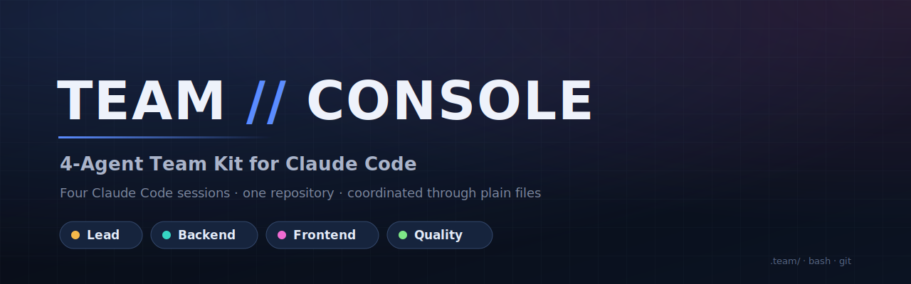
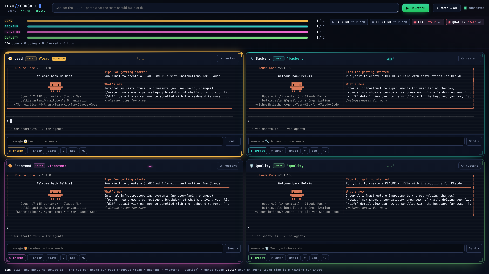
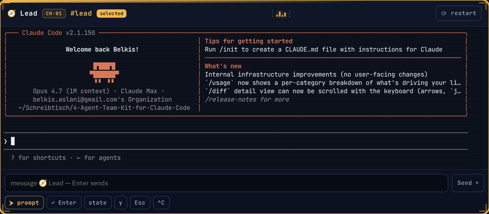
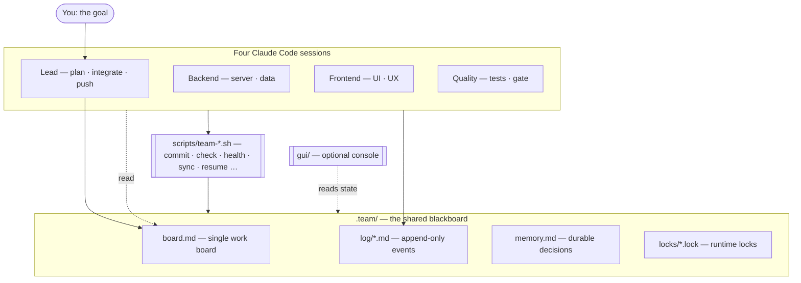

<div align="center">



### Four Claude Code sessions. One repository. Coordinated through plain files.

A **task-agnostic** scaffold that lets four Claude Code agents build one repo together —
no database, no message broker, no framework. Coordination lives entirely in a `.team/`
folder of Markdown and a handful of POSIX shell scripts.

<p>
  <a href="https://github.com/BEKO2210/4-Agent-Team-Kit-for-Claude-Code/actions/workflows/gate.yml"></a>
  <a href="LICENSE"></a>
  
  
  
</p>

<a href="#quickstart"><b>Quickstart</b></a> ·
<a href="#usage"><b>Usage</b></a> ·
<a href="#architecture"><b>Architecture</b></a> ·
<a href=".team/PROTOCOL.md"><b>Protocol</b></a> ·
<a href="ROADMAP.md"><b>Roadmap</b></a> ·
<a href="CHANGELOG.md"><b>Changelog</b></a> ·
<a href="README.de.md"><b>Deutsch</b></a>

</div>

---

## Contents

- [Why this exists](#why-this-exists)
- [Features](#features)
- [Preview](#preview)
- [Quickstart](#quickstart)
- [Usage](#usage)
- [Architecture](#architecture)
- [Project structure](#project-structure)
- [Quality and security](#quality-and-security)
- [Roadmap](#roadmap)
- [Contributing](#contributing)
- [License](#license)
- [Acknowledgements](#acknowledgements)

---

## Why this exists

Running several AI coding agents on one repository usually ends in chaos: they overwrite
each other's files, race on commits, and lose track of who is doing what. The common fix
is a heavyweight orchestration framework with its own runtime and learning curve.

This kit takes the opposite path. Coordination is reduced to its primitives — a **board**,
per-agent **logs**, file **locks**, and a **green gate** — and each primitive is implemented
with nothing more than the file system and Git. The result is a coordination *protocol*,
not a framework: copy it into any repo, open four terminals, and the agents stay in their
lanes, serialize their commits, and never ship red.

**Who it's for**

- Developers who want to drive a small team of Claude Code agents on a real codebase.
- Anyone curious how multi-agent coordination works without framework lock-in.
- Teams that need coordination with **zero external infrastructure**.

> [!NOTE]
> This is a coordination scaffold, not an autopilot. You supply the goal; the agents do the
> work within the rules in [`.team/PROTOCOL.md`](.team/PROTOCOL.md).

## Features

| | Feature | What it does |
|---|---|---|
| 🗂️ | **File-based coordination** | All state lives in `.team/` (board, logs, roles, locks) — readable, auditable, Git-versioned. No services to run. |
| 🔒 | **Atomic commit serialization** | `team-commit.sh` takes an atomic `mkdir` lock, runs the gate, stages only your paths, commits as `[role] …`. Never `git add -A`. |
| ✅ | **Green gate** | `team-check.sh` must pass before any commit — "never commit red." Edit one file to match your stack. |
| 🫀 | **Health, stale-task & deadlock detection** | `team-health.sh` reports each agent's liveness, flags tasks stuck `doing`, and signals when everything is blocked. |
| 🔁 | **Board ↔ log reconciliation** | `team-sync.sh` treats the append-only logs as the source of truth and reports where the board has drifted. |
| ♻️ | **Crash recovery & memory** | `team-resume.sh` rebuilds state from logs + Git; `.team/memory.md` carries decisions across runs. |
| 🛟 | **Resilience** | Fallback-lead (`team-lead-claim.sh`) and `.team/` snapshots (`team-backup.sh`) so a stalled lead or a bad push isn't fatal. |
| 🌿 | **Stronger isolation (optional)** | `team-worktrees.sh` gives each agent its own Git worktree + branch; the lead integrates by merge. |
| 🖥️ | **Optional live console** | A tiny local web UI (`gui/`) runs all four sessions in one window. Per-role progress bars, role-coloured cards with corner brackets and channel callsigns, a centred equalizer-style activity meter, a clear "selected" ring on the focused card, and an auto-pulsing "⚠ needs input" badge when an agent looks like it's waiting for a confirmation. |
| 🔌 | **Optional MCP server** | `mcp/` exposes the team state (board, logs, memory, health, metrics) as read-only Model Context Protocol resources for any MCP client. |
| 🧬 | **Typed state contract** | [`schema/team-state.schema.json`](schema/team-state.schema.json) is the machine-validatable contract honoured by `/state`, the MCP server, and `team-snapshot.sh`. Snapshots can be diffed with `team-diff.sh` to see exactly what moved between two points in time. |
| 🧪 | **Tested in CI** | A self-contained Bash test suite (`tests/run.sh`, currently 88 checks) runs on every push via [`.github/workflows/gate.yml`](.github/workflows/gate.yml) — no test framework required. |

## Preview

The optional GUI — **TEAM // CONSOLE** — runs all four agents in one window and shows a live
vitals strip (per-role progress bars and per-agent health) derived from `.team/`.



A closer look at one card — corner brackets in the role colour, channel callsign
(`CH·01`), the centred 4-bar activity meter that animates with live terminal output,
and a "selected" badge when the card is focused:



Launch it locally with [`node gui/server.js`](#optional-the-gui) — see [Usage](#usage).

## Quickstart

> [!IMPORTANT]
> Prerequisites: **Bash**, **Git**, and the **[Claude Code](https://claude.com/claude-code) CLI**.
> The optional GUI additionally needs **Node.js** (18+).

**0. See the kit in action without installing Claude Code**

```bash
git clone https://github.com/BEKO2210/4-Agent-Team-Kit-for-Claude-Code
cd 4-Agent-Team-Kit-for-Claude-Code
bash scripts/team-demo.sh         # 30-second self-running demo of the helpers
```

**1. Drop the kit into your repo**

```bash
# one-command install (from inside the kit's directory)
bash scripts/team-init.sh /path/to/your/repo
```

Or copy by hand if you prefer — `scripts/team-init.sh` is short and self-documenting.

**2. Point the gate and lanes at your project**

```bash
$EDITOR scripts/team-check.sh     # set your real lint + test command
$EDITOR .team/roles/*.md          # point each lane's globs at YOUR repo
```

**3. Verify the scripts work**

```bash
bash tests/run.sh                 # the script test suite (88 checks at last count); all should pass
scripts/team-health.sh            # prints a team-health report
```

## Usage

**Run the team (four terminals)**

1. Open **4 terminals** in the repo and run `claude` in each.
2. Paste the matching block from [`PROMPTS.md`](PROMPTS.md) — Lead, Backend, Frontend, Quality.
3. In the **Lead** terminal, replace `<<< paste … >>>` with your goal.
4. The lead fills the board and pings the others; they start working their lanes.
5. Nudge any terminal with `state` to push it forward; it continues autonomously.
6. Done when every board row is `done`, quality signs the gate, and the lead pushes.

> [!TIP]
> `state` means *do the next thing*, not *report*. A nudged agent re-reads the board and
> the other logs, unblocks others first, and keeps the gate green.

**The rules in one breath**

Stay in your lane · write only your own files · commit only via `team-commit.sh` (never
`git add -A`) · green before commit · only the lead pushes · heavy ops under a lock · log
every step.

**Coordination helpers**

```bash
scripts/team-health.sh                  # who's active/idle/stale · stale tasks · deadlock
scripts/team-sync.sh [--strict]         # where board.md drifts from the logs (lead reconciles)
scripts/team-resume.sh                  # rebuild state from logs + git after a crash/restart
scripts/team-metrics.sh                 # throughput per role + board progress → .team/metrics.md
scripts/team-backup.sh [restore [file]] # snapshot / restore .team/ (git isn't the only copy)
scripts/team-lead-claim.sh <role>       # fallback-lead: record the acting lead
scripts/team-lint-log.sh                # validate structured @role handoff lines
scripts/team-worktrees.sh setup         # per-role git worktrees for stronger isolation
scripts/team-role.sh add <name> <globs> # add a runtime role + emit its start prompt
scripts/team-handoff.sh                 # produce a briefing for a fresh session
scripts/team-sections.sh                # per-section view (board.md "## name" headings)
scripts/team-federate.sh <repo>...      # aggregate boards across multiple repos
scripts/team-snapshot.sh [--save]       # capture full state as one JSON document (schema/)
scripts/team-diff.sh A.json B.json      # diff two snapshots
scripts/team-init.sh <target>           # one-command install into another repo
scripts/team-demo.sh                    # 30-second self-running demo (no Claude Code needed)
scripts/team-commit.sh --dry-run <role> "msg" <paths>   # run the gate + preview, don't commit
```

<details>
<summary><b>Tunables &amp; behaviour</b></summary>

- `TEAM_ACTIVE_SECS` (default `900`) and `TEAM_STALE_SECS` (default `1800`) set the
  liveness/stale-task thresholds for `team-health.sh`.
- Lock, commit, and health events are appended to `.team/log/events.log` (gitignored).
- `.team/memory.md` is read at kickoff and carries durable decisions across runs.
- Logs are the authority for automated reconciliation; the board is the human-facing view.

</details>

<a id="optional-the-gui"></a>

**Optional — the GUI**

```bash
cd gui && npm install && cd ..
node gui/server.js            # → http://localhost:4173
```

The console runs each agent as a real terminal, adds buttons for the common commands
(Kickoff, `state`, Enter, `y`, Esc, ^C, restart), and polls `.team/` for the live vitals
strip. Details in [`gui/README.md`](gui/README.md).

## Architecture



- **Agents** are four `claude` sessions, each with an explicit lane and definition-of-done
  in [`.team/roles/`](.team/roles).
- **`.team/`** is the blackboard: the lead owns `board.md`; every agent appends only to its
  own `log/*.md`; `memory.md` survives across runs.
- **`scripts/`** are the only sanctioned way to commit and run heavy/exclusive operations;
  [`lib/lock.sh`](scripts/lib/lock.sh) provides the atomic lock used everywhere.

## Project structure

```text
.
├─ .team/
│  ├─ PROTOCOL.md         # the rules (read-only, never changes)
│  ├─ board.md            # the single work board (lead-owned)
│  ├─ memory.md           # durable, run-spanning decisions
│  ├─ roles/              # per-agent lane + definition-of-done
│  └─ log/                # per-agent append-only logs
├─ scripts/
│  ├─ lib/lock.sh         # atomic mkdir lock + event-log helpers
│  ├─ team-commit.sh      # lock → gate → stage your paths → commit "[role] …"
│  ├─ team-check.sh       # the green gate (edit for your stack)
│  ├─ team-exclusive.sh   # serialize heavy ops (build/e2e/migrations)
│  ├─ team-health.sh      # liveness · stale tasks · deadlock
│  ├─ team-sync.sh        # board ↔ log drift report
│  ├─ team-resume.sh      # rebuild state after a crash/restart
│  ├─ team-metrics.sh     # throughput + board progress
│  ├─ team-backup.sh      # snapshot / restore .team/
│  ├─ team-lead-claim.sh  # fallback-lead
│  ├─ team-lint-log.sh    # validate @role handoff lines
│  ├─ team-worktrees.sh   # per-role git worktrees
│  ├─ team-role.sh        # add / list / remove team roles at runtime
│  ├─ team-handoff.sh     # produce a briefing for a fresh Claude Code session
│  ├─ team-sections.sh    # per-section board view (sub-teams)
│  ├─ team-federate.sh    # cross-repo aggregation for a meta-lead view
│  ├─ team-snapshot.{sh,mjs} # capture full state as one JSON document
│  ├─ team-diff.{sh,mjs}     # diff two snapshots
│  ├─ team-init.sh           # one-command install into another repo
│  └─ team-demo.sh           # self-running demo of the helpers
├─ gui/                   # optional one-window web console (Node.js)
├─ mcp/                   # optional read-only MCP server (exposes .team/ as resources)
├─ schema/                # JSON Schema for the team state contract
├─ examples/              # worked examples (todo-cli, …)
├─ .github/workflows/     # GitHub Actions (gate workflow runs the suite on every push)
├─ tests/run.sh           # Bash test suite (88 checks at last count)
├─ docs/console.png       # GUI screenshot
├─ PROMPTS.md             # the 4 copy-paste terminal prompts
├─ ROADMAP.md             # phased plan + implementation state
└─ LICENSE                # MIT
```

## Quality and security

- **Continuous integration** — every push runs [`.github/workflows/gate.yml`](.github/workflows/gate.yml),
  which executes the full green gate (`bash -n` + `shellcheck` + the test suite) on Ubuntu.
- **Tests** — `bash tests/run.sh` runs 88 sandboxed checks against the real scripts; no
  external test framework is required. `mcp/test.js` adds 12 MCP smoke checks.
- **Green gate** — [`scripts/team-check.sh`](scripts/team-check.sh) syntax-checks every
  script (`bash -n`), runs `shellcheck -S warning` when available, and runs the test suite.
- **Concurrency safety** — locks use an atomic `mkdir` directory with PID-liveness stale
  detection and an atomic, rename-based break, so two agents can't both acquire one lock.
- **Privacy** — everything is local and file-based: the coordination state lives in your
  own repo, and runtime artifacts (`events.log`, `locks/`, `state/`, `backups/`, `metrics.md`)
  are gitignored.

> [!NOTE]
> There is no `SECURITY.md` yet — please report concerns privately to the maintainer
> (see [LICENSE](LICENSE) for contact context).

## Roadmap

Shipped in this repo:

- [x] Atomic locking library + serialized commits (`lib/lock.sh`, `team-commit.sh`)
- [x] Green gate, dry-run commits, central event log
- [x] Health, stale-task & deadlock detection (`team-health.sh`)
- [x] Board ↔ log drift reconciliation (`team-sync.sh`)
- [x] Crash recovery (`team-resume.sh`) + run-spanning memory (`memory.md`)
- [x] Fallback-lead (`team-lead-claim.sh`) + state backup (`team-backup.sh`)
- [x] Throughput metrics (`team-metrics.sh`)
- [x] Structured handoff schema + linter (`team-lint-log.sh`)
- [x] Git worktrees for stronger isolation (`team-worktrees.sh`)
- [x] Live web console with vitals (`gui/`, `/state`)
- [x] Dynamic / additional roles at runtime (`team-role.sh`)
- [x] Cross-session handoff briefing (`team-handoff.sh`)
- [x] GitHub Actions CI + live badge (`.github/workflows/gate.yml`)
- [x] Optional read-only MCP server exposing coordination state (`mcp/`)
- [x] Sub-team sections in the board (`team-sections.sh`)
- [x] Cross-repo federation for multi-service teams (`team-federate.sh`)
- [x] Typed state contract + snapshots & diff (`schema/`, `team-snapshot.sh`, `team-diff.sh`)

All numbered roadmap milestones are shipped. The remaining backlog is the optional
"academic" appendix (BDI / Contract Net / partial global planning / org self-design),
which the kit intentionally omits to stay simple — see [`ROADMAP.md`](ROADMAP.md).

See [`ROADMAP.md`](ROADMAP.md) for the full phased plan, priorities, and rationale.

## Contributing

Contributions are welcome. Please open an issue first for anything non-trivial so we can
agree on the shape of the change. The full contributor guide lives in
[`CONTRIBUTING.md`](CONTRIBUTING.md); the project ships with a
[`CODE_OF_CONDUCT.md`](CODE_OF_CONDUCT.md) and a [`SECURITY.md`](SECURITY.md) that
explains how to report vulnerabilities privately. Before opening a PR, run the gate:

```bash
bash scripts/team-check.sh
```

## License

[MIT](LICENSE) — Copyright © 2026 Belkis Aslani (BEKO2210). Use it freely, including
commercially. Commercial support, custom integrations and dual-licensing for embedded
use are available — see [`COMMERCIAL.md`](COMMERCIAL.md).

## Acknowledgements

- Built for [Claude Code](https://claude.com/claude-code) by Anthropic.
- The optional GUI uses [xterm.js](https://xtermjs.org/), [node-pty](https://github.com/microsoft/node-pty), and [ws](https://github.com/websockets/ws).
- Distilled from a real multi-agent run, with the friction designed out.
