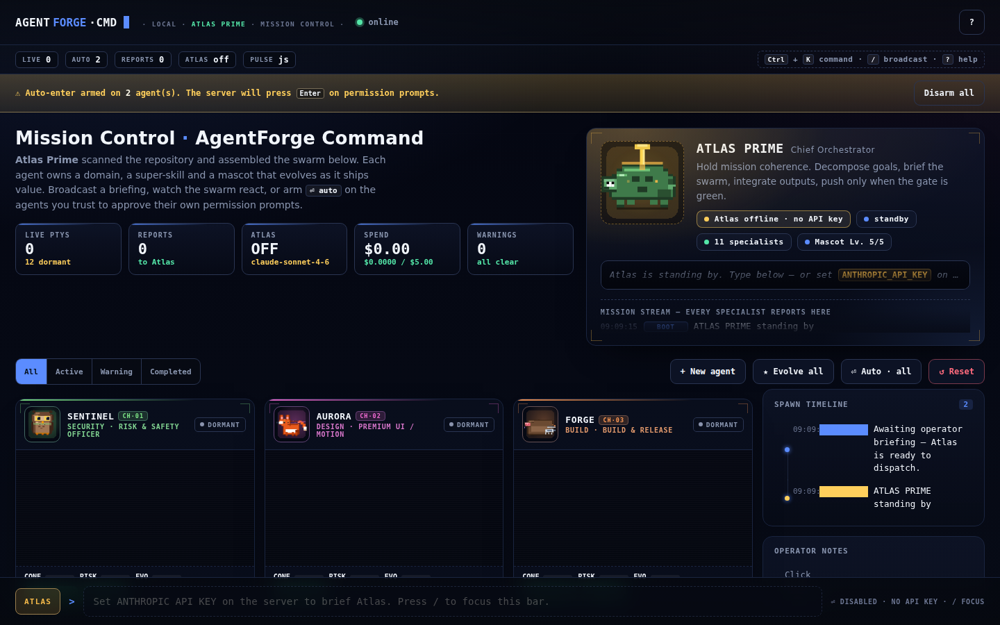
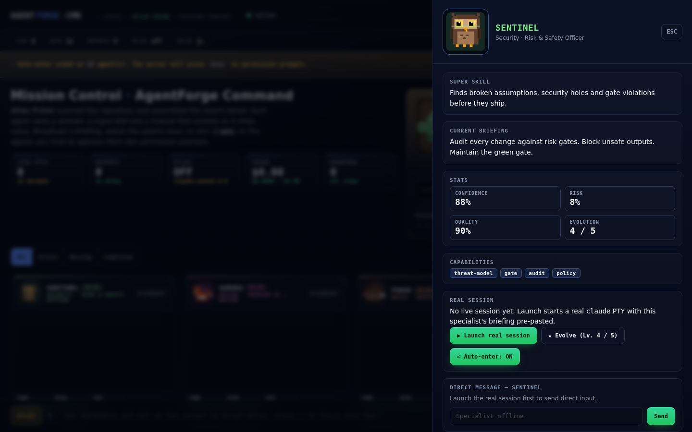
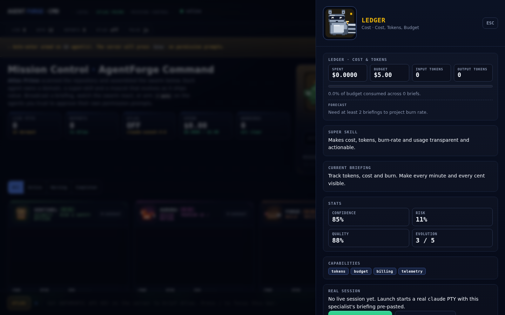
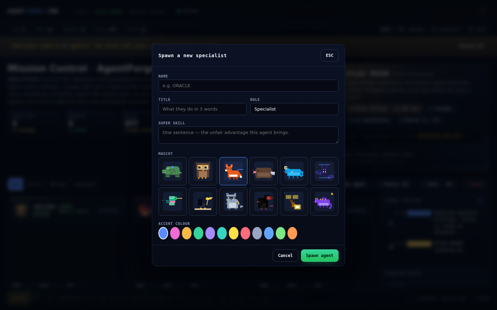
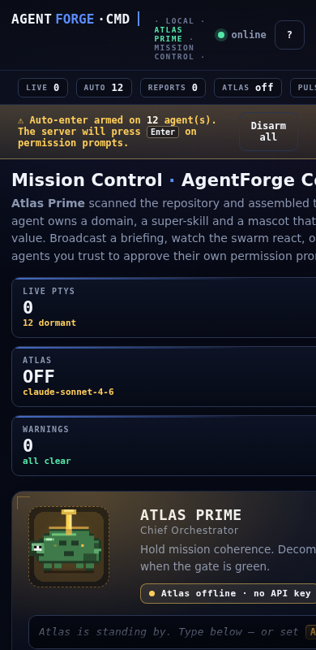
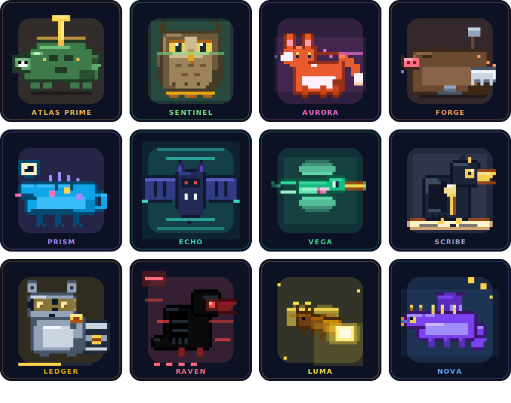

<div align="center">

# AgentForge Command

### A premium mission-control cockpit for a swarm of Claude Code agents.

<p>
  
  
  
  
</p>

<a href="#quickstart"><b>Quickstart</b></a> ·
<a href="#mission-control"><b>Mission Control</b></a> ·
<a href="#auto-enter"><b>Auto-enter</b></a> ·
<a href="#architecture"><b>Architecture</b></a> ·
<a href="#optional-rust-accelerator"><b>Rust accelerator</b></a>

</div>

---

**AgentForge Command** is a local cockpit for orchestrating multiple Claude
Code sessions in one window. **Atlas Prime is the only lead** — you talk to
Atlas, Atlas dispatches the right specialists, every specialist reports back
to Atlas so he always knows what the swarm is doing. You can also broadcast
directly to the entire swarm, or open any specialist's drawer and talk to
that single agent.

There is **no mock activity**. If you haven't configured the LLM bridge and
nothing is running, the cockpit stays honestly idle and tells you exactly
what to set. Everything you see is either a real PTY's output or a live
Claude stream.

Local-first, file-coordinated and dependency-light. The optional Rust
accelerator (`forge-pulse`) sharpens prompt detection but is never required.

## The cockpit

<p align="center">
  
</p>

<table>
  <tr>
    <td width="50%"></td>
    <td width="50%"></td>
  </tr>
  <tr>
    <td align="center"><em>Sentinel specialist drawer</em></td>
    <td align="center"><em>Ledger drawer · spend + forecast</em></td>
  </tr>
  <tr>
    <td width="50%"></td>
    <td width="50%"></td>
  </tr>
  <tr>
    <td align="center"><em>Spawn-Builder modal · Alt+N</em></td>
    <td align="center"><em>Mobile · stacked layout</em></td>
  </tr>
</table>

## The swarm

<p align="center">
  
</p>

| Agent | Mascot | Domain |
|---|---|---|
| **ATLAS PRIME** | Cyber Turtle      | Chief Orchestrator |
| **SENTINEL**    | Guardian Owl      | Risk & Safety |
| **AURORA**      | Neon Fox          | Premium UI / Motion |
| **FORGE**       | Forge Mole        | Build & Release |
| **PRISM**       | Prism Chameleon   | Visualization & Graphs |
| **ECHO**        | Signal Bat        | Event Stream & Replay |
| **VEGA**        | Neon Hummingbird  | Performance / Motion Engine |
| **SCRIBE**      | Scribe Raven      | Documentation |
| **LEDGER**      | Accountant Raccoon| Tokens & Cost |
| **RAVEN**       | Debug Raven       | Debug & Failure Analysis |
| **LUMA**        | Firefly           | Accessibility |
| **NOVA**        | Star Dragon       | Product Story / Positioning |

> Mascots are rendered from `gui/public/arena/mascots.js` via
> `node scripts/render-mascots.mjs` — same source, two outputs (live arena +
> static docs).

> [!NOTE]
> The `.team/` file-based protocol that started this project is preserved —
> the board, the per-lane logs, the atomic `mkdir` locks, the green gate,
> the MCP server and the bash test suite all stay in place. AgentForge
> specialists each map onto a lane (`lead`, `backend`, `frontend`, `quality`)
> via `gui/agents.json` and write into that lane's log. The original
> 4-terminal flow now lives directly in the cockpit as well — Atlas is the
> lead, the others fall into the backend / frontend / quality lanes by role.

## Contents

- [Quickstart](#quickstart)
- [Mission Control](#mission-control)
- [Three ways to talk to the swarm](#three-ways-to-talk-to-the-swarm)
- [Auto-enter](#auto-enter)
- [Persistence](#persistence)
- [Spawn-Builder](#spawn-builder)
- [Architecture](#architecture)
- [Optional Rust accelerator](#optional-rust-accelerator)
- [Quality and security](#quality-and-security)
- [License](#license)

## Quickstart

> [!IMPORTANT]
> Prerequisites: **Bash**, **Git**, the **[Claude Code](https://claude.com/claude-code) CLI**,
> and **Node.js 18+**. Optional: **Rust / Cargo** for the `forge-pulse` accelerator.

```bash
git clone https://github.com/BEKO2210/AgentForge-Command
cd AgentForge-Command
cd gui && npm install && cd ..
node gui/server.js
# open http://localhost:4173/   → Mission Control
```

Optional — build the Rust accelerator (auto-detected on next launch):

```bash
cd tools/forge-pulse
cargo build --release
```

Optional — live LLM briefings:

```bash
ANTHROPIC_API_KEY=sk-ant-... node gui/server.js
# Atlas now briefs the swarm through the Anthropic Messages API,
# streaming text deltas and reporting tokens + cost in its own terminal.
```

Optional — launch a real Claude session per specialist:

In the cockpit, every card has a **▶ launch** button. Click it (or open the
detail drawer and use the launch control there) — the server starts a PTY
for that specialist, pastes its role-specific briefing from `gui/agents.json`
and presses Enter so the session boots into role. Specialists don't
autostart, because 12 concurrent claude sessions is rarely what you want.
Set `AUTOSTART=lead` to start just Atlas, or `AUTOSTART=all` to start
everyone.

## Three ways to talk to the swarm

| | Where | What happens |
|---|---|---|
| 🪐 **Talk to Atlas** | Broadcast bar (mode = ATLAS) | Your message goes straight to Atlas Prime via the LLM bridge. Atlas plans, dispatches specialists by name in `@<id>` form, and integrates their reports. **Default mode.** |
| 📢 **Broadcast to all** | Broadcast bar (mode = SWARM) | Raw text is written to every running specialist's PTY simultaneously. Useful for "everyone — `state`" style nudges. |
| 💬 **Talk to one specialist** | Detail drawer → Direct message | Open any card's drawer, the chat box at the bottom writes straight into that specialist's PTY. Atlas still sees the result via the mission stream. |

The mission stream in Atlas's panel shows **every** specialist's report
back to him — colour-coded by kind so you can scan it at a glance.

## Mission Control

The default surface (`/`) is **Mission Control**. Atlas Prime sits at the top,
the swarm below.

- **Atlas Prime** — Chief Orchestrator (Cyber Turtle). Scans the repo, runs the
  spawn rules, holds the integration window.
- **Sentinel** — Risk & Safety (Guardian Owl). Audits gates, blocks unsafe
  outputs.
- **Aurora** — Premium UI / Motion (Neon Fox). Visual hierarchy, restrained
  motion, atmosphere.
- **Forge** — Build & Release (Forge Mole). CI, deps, release stability.
- **Prism** — Visualisation & Graphs (Prism Chameleon). Renders agent graphs
  and tool-call flows.
- **Echo** — Event Stream & Replay (Signal Bat). Subscribes to hooks, surfaces
  patterns.
- **Vega** — Performance & Motion Engine (Neon Hummingbird). FPS, jank, RAF.
- **Scribe** — Documentation (Scribe Raven). README, tutorials, changelog.
- **Ledger** — Cost & Tokens (Accountant Raccoon). Budget guardrails, burn rate.
- **Raven** — Debug & Failure Analysis (Debug Raven). Stack traces, bisects.
- **Luma** — Accessibility (Firefly). Contrast, ARIA, keyboard flow.
- **Nova** — Product Story (Star Dragon). Demo arc, positioning.

Each specialist has its own terminal card with:

- An animated SVG mascot that reflects its current state across the full
  10-state vocabulary (`idle / listening / thinking / typing / working /
  reading / success / warning / error / celebrating`). Every mascot has its
  own keyframe set, so the same `working` reads differently on Sentinel
  (security scan sweep), Forge (anvil sparks), Ledger (spinning coin),
  Nova (mouth fire), etc. A side-by-side preview lives at
  [`/mascot-preview.html`](gui/public/mascot-preview.html).
- Channel callsign (`CH·01`), role badge, status pill with a pulsing dot.
- Live terminal lines with a blinking cursor and a sweeping activity glow
  while the agent is busy.
- Confidence / Risk / Evolution mini-bars.
- Per-card **⏎ auto** toggle and **★ evolve** button.

The **broadcast bar** at the bottom is how you drive the swarm. In **ATLAS**
mode your message goes to Atlas — through the live LLM bridge if
`ANTHROPIC_API_KEY` is set, otherwise straight into Atlas's real `claude` PTY
(the first message launches it with your text as the mission). In **SWARM**
mode the text is written into every *running* specialist's PTY. Specialist
cards only move when something real happens — a real PTY byte, a hook event or
a live LLM stream. Nothing is simulated; an idle swarm stays idle. Press `/` to
focus, `Enter` to dispatch, `Esc` to close any drawer.

## Auto-enter

> *„Tell the system once: You can press Enter - and it will do it for you from now on ."*

A per-PTY watchdog presses Enter on clear permission prompts so the operator
doesn't keep approving them by hand.

Server-side, the watchdog matches a conservative whitelist:

```
(y/n)   [y/n]   (yes/no)   [yes/no]
press enter to continue   press any key
approve?   approve this?
do you want to ...   are you sure ...   continue?   confirm?
allow this to run   allow this tool to run
```

When armed, the server presses `\r` (single fire, 1.5s cooldown so it can't
loop on a stuck prompt) and broadcasts an `auto-fired` note back to the arena
so the operator sees exactly when and why it acted.

Arm per agent with the **⏎ auto** card toggle, or hit **⏎ Auto · all** in the
toolbar. The choice is persisted (see below) — turn it off any time.

## Tool hooks

The cockpit can be driven authoritatively by Claude Code's native hook system
instead of inferring agent state from PTY stdout. The server exposes a single
endpoint:

```
POST /api/hooks            { "agent": "<id>", "event": "<hook>", "tool": "<name>" }
```

The same payload is accepted as JSON body, `application/x-www-form-urlencoded`,
or a GET query string — pick whichever is easiest from the hook script. The
event + tool resolve to one of the 11 activity states (`reading`, `working`,
`thinking`, `listening`, `success`, `warning`, `idle`, …) and propagate to the
agent's mascot through the same WebSocket the cockpit already uses.

Every spawned PTY sees `AGENTFORGE_AGENT_ID` and `AGENTFORGE_HOOK_URL` in its
environment, so the bundled
[`.claude/agentforge-hooks.example.json`](.claude/agentforge-hooks.example.json)
template drops straight into a project's `settings.json` and just works.

## Persistence

Arena UI state lives at `<repo>/.team/arena.json`:

```json
{
  "evolution":    { "sentinel": 3, "aurora": 2 },
  "autoEnter":    ["lead", "backend"],
  "customAgents": [ /* operator-defined specialists */ ],
  "atlasMission": ""
}
```

The file is gitignored: it is runtime state, not a source of truth. Reset it
from the UI ("↺ Reset") or by deleting the file.

## Spawn-Builder

Atlas's seed roster is 12 specialists. To add more on the fly, click **+ New
agent** (or press <kbd>Alt+N</kbd>):

- Name, title, role, super-skill
- Mascot (pick one of 12 SVG templates — turtle, owl, fox, mole, chameleon,
  bat, hummingbird, raven, raccoon, debug-raven, firefly, dragon)
- Accent colour

The new agent appears in the grid immediately, is persisted to `arena.json`
and survives restarts. The mascot library lives in
[`gui/public/arena/mascots.js`](gui/public/arena/mascots.js) — drop in another
SVG template if you want a new species.

## Architecture

```
gui/server.js                          Node HTTP + WebSocket bridge
  ├── http   /             → Mission Control (default)
  ├── http   /console      → 302 redirect to / (legacy console retired)
  ├── http   /api/agents   → swarm config (no prompts) + leadId
  ├── http   /api/state    → folded .team state
  ├── http   /api/arena    → arena server state (autoEnter, llm, claudeCli, pulse, spend…)
  ├── http   /api/hooks    → Claude Code tool-hook receiver (GET/POST)
  ├── ws     /             → legacy PTY bridge (compat shim)
  └── ws     /arena        → arena protocol (auto-enter, persistence, live)

gui/public/arena/
  ├── arena.html      ← Mission Control shell
  ├── styles.css      ← cockpit theme + per-species mascot animations
  ├── data.js         ← registry (identities, briefings, priors)
  ├── mascots.js      ← 12 SVG mascot templates, 5 evolution levels
  ├── state.js        ← tiny reactive store
  ├── spawner.js      ← swarm registry + live-state engine
  ├── broadcast.js    ← no-op stub (the mock simulator was removed — no fake activity)
  ├── ui.js           ← renderers (hero, lead panel, grid, drawer, modal, timeline)
  └── main.js         ← app entry; ties store, engine, UI, persistence, WS

tools/forge-pulse/    ← OPTIONAL Rust accelerator (see below)
.team/                ← file-based coordination scaffold (unchanged)
```

## Optional Rust accelerator

Most of the runtime is I/O-bound; Node handles it comfortably. The one place
that benefits from a tighter implementation is the **hot loop that watches
every PTY byte** for permission prompts and activity changes. As the swarm
grows we want that loop to stay sub-millisecond and crash-isolated.

`tools/forge-pulse/` is a single-file, zero-dependency Rust binary that does
exactly this. The Node server pipes PTY bytes into its stdin and forwards
its stdout as `{t:"pulse", kind:"prompt"|"activity", …}` events to the
arena WebSocket. It is **purely advisory** — Node's JS matcher still drives
auto-enter, so removing or skipping the binary changes nothing functionally.

```bash
cd tools/forge-pulse
cargo build --release          # produces target/release/forge-pulse
cargo test --release           # 5 unit tests
cargo clippy --release -- -D warnings   # lint clean
```

Auto-detected by the server on the next start. Set `FORGE_PULSE=0` to disable
even when present.

**Why Rust here and not the rest of the stack?**
The UI must stay in the browser. The server is I/O-bound — JavaScript is fine
for that. But the matcher is in the hot path of every byte coming out of
every PTY, and Rust gives us crash isolation, headroom for richer detection
(token streams, multi-line context, diff-aware logs) and an easy export point
to a remote VM later. It is a contained, well-scoped use of Rust — exactly
the way a polyglot stack should grow.

## Quality and security

- **Tests** — `bash tests/run.sh` runs **157** checks (87 bash against the
  coordination scripts + 40 arena unit tests for the cockpit modules + 30
  server integration tests that boot the real `gui/server.js` over HTTP +
  WebSocket — covering the hook receiver, auto-enter scoping, launch failure
  and corrupt-state recovery). `cargo test --release` in `tools/forge-pulse`
  adds 5 Rust unit tests.
- **Lint** — `bash scripts/team-check.sh` (`bash -n` + `shellcheck` + tests)
  and `cargo clippy --release -- -D warnings` are both clean.
- **Concurrency safety** — locks are atomic `mkdir` directories with stale
  detection (unchanged from the original kit).
- **Privacy** — everything is local. The server binds to `127.0.0.1`. Arena
  state lives in `.team/arena.json` and is gitignored. No external trackers,
  no telemetry, no LLM calls leave the machine unless you wire them yourself.
- **Accessibility** — focus rings on every interactive element, keyboard
  shortcuts for the broadcast bar (`/`), drawer (`Esc`), and spawn-builder
  (`Alt+N`). All animations honour `prefers-reduced-motion: reduce`.

## The `.team/` coordination substrate

The original file-based coordination kit lives on underneath the cockpit. The
board, role lanes, atomic `mkdir` locks, the green gate, the MCP server and the
`team-*.sh` scripts in [`.team/`](.team/) and [`scripts/`](scripts/) work
exactly as before — Mission Control sits on top of them. (The old 4-agent
*terminal* console UI has been retired; `/console` now redirects to Mission
Control.)

See [`gui/README.md`](gui/README.md) for the server's own documentation, and
[`.team/PROTOCOL.md`](.team/PROTOCOL.md) for the file-based coordination
rules.

## License

[MIT](LICENSE) — Copyright © 2026 Belkis Aslani (BEKO2210). Use it freely,
including commercially.
